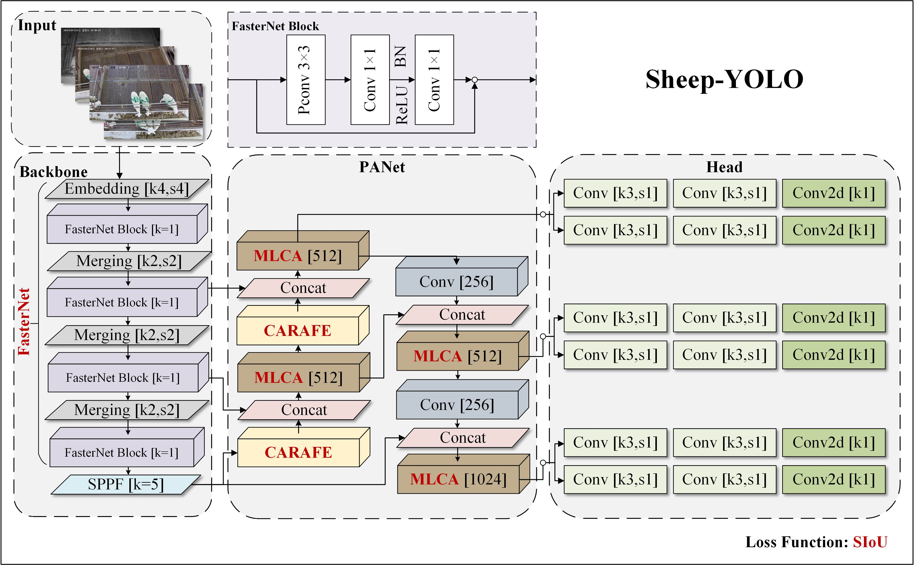

## Sheep-YOLO: Improved and Lightweight YOLOv8n for Precise and Intelligent Recognition of Fattening Lambs' Behaviors and Vitality Statuses

## Contents
1. [Network structure diagram of Sheep-YOLO](#Network structure)
2. [Main improvements in Sheep-YOLO](#Main improvements in Sheep-YOLO)
3. [Environment](#Environment)
4. [Download](#Download)
5. [Train](#Train)
6. [Test](#Test)
7. [Predict](#Predict)


## Network structure


## Main improvements in Sheep-YOLO
Main improvements compared to YOLOv8n basic model
```bash
# (1) This file visualizes the differences between Sheep-YOLO and the YOLOv8n model. This document shows the network architecture of Sheep-YOLO. 
# In that file, we provide a detailed description of each layer of Sheep-YOLO's network and a detailed analysis of the change in feature map size after each layer of the network in the annotations.
'ultralytics/cfg/models/v8/Sheep-YOLO/Sheep-YOLO.yaml' 

#(2)The FasterNet lightweight networking code covered in the article can be found in the following files.
'ultralytics/nn/modules/block.py'  # Lines 3657-3725
'ultralytics/nn/tasks.py' # Line 733, Line 745

# (3)The Mixed Local Channel Attention (MLCA) module covered in the article can be found in the following file
'ultralytics/nn/modules/MLCA.py'

# (4)The Content-Aware ReAssembly of FEatures (CARAFE) covered in the article can be found in the following document
'ultralytics/nn/modules/block.py'# Lines 3525-3565
```


## Environment
```bash
# Hardware configuration
Intel Xeon E5-2686 v4 (2.3GHz) CPU with 64 GB of RAM
NVIDIA GeForce RTX 4090 56 GB GPU
# Software environment
python == 3.10.9
torch == 2.0.1
torchvision == 0.15.2
CUDA==11.8
cuDNN==8.7.0
OpenCV-Python==4.9.0
```

## Download
(1)Weights File: Weights trained using Sheep-YOLO can be downloaded through the link below.  

Link: https://drive.google.com/drive/folders/1PmelrCOimeWRv2DJ6h73bqEQUPvyuQHi

(2)Dataset:The dataset of fattening lamb produced by ours can be downloaded through the link below.

Link: https://drive.google.com/drive/folders/1bgomAucn6YClPx7tueca_i6aYcID3GdD


## Train
(1) Configuration environment  
```bash
pip install ultralytics
pip install requirements.txt
```
(2) Change the dataset path in 'ultralytics/cfg/datasets/sheep.yaml' to your own path


(3) Modify the path to the yaml file and the path to the data in train.py, where you can change the values of hyperparameters such as epoch and batch.
```bash
if __name__ == '__main__':
    model = YOLO('ultralytics/cfg/models/v8/Sheep-YOLO/Sheep-YOLO.yaml')  # build a new model from YAML
    model.train(
        data='ultralytics/cfg/datasets/sheep.yaml',
        epochs=32,
        imgsz=640,
        batch=1,
        save_period=5,
        resume=True,
        patience=200,
        project='runs/train/',
    )
```


## Test
Run test.py to get the performance metrics performance of the trained model.
```bash
if __name__ == '__main__':
    model = YOLO('D:/deeplearning/compare_model_weights/improved_yolov8/best.pt') # 自己训练结束后的模型权重
    model.val(data='ultralytics/cfg/datasets/sheep.yaml',
              split='test',
              imgsz=640,
              batch=32,
              save_json=True, # if you need to cal coco metrice
              project='runs/test',
              name='exp',
              )
```

## Predict
Run predict.py to be able to get the image/video detection results


